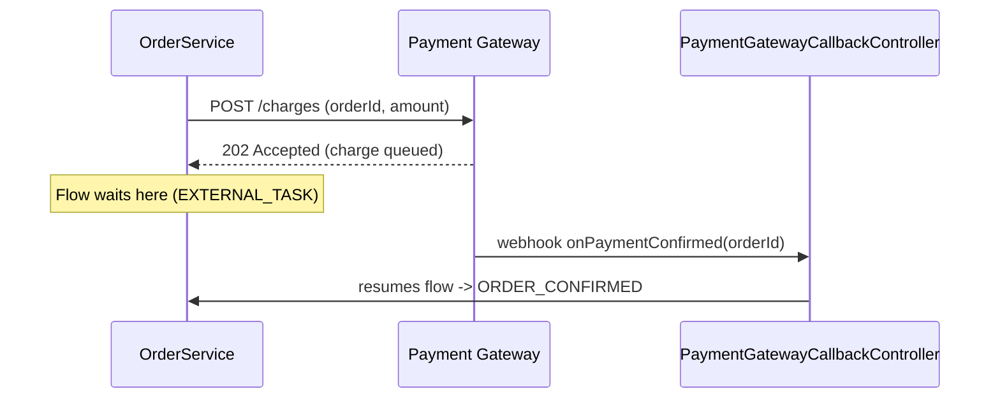

# Tutorial: example prompts and expected results

*[Leia isso em português](TUTORIAL.pt-br.md)*

This walks through one realistic prompt per skill, what the skill actually does with it internally, and
what comes back — including the two behaviors that are easy to miss just from reading the `SKILL.md` files:
a construction skill flagging a genuine gap in the input instead of inventing an answer, and the deliberate
two-pass handoff from a construction skill into `beautify-kikwi-diagram`. Full output files referenced below
live under each skill's `examples/` folder — this document only shows excerpts.

Prerequisite: copy `skills/` into `.claude/skills/` in your target project (see [`README.md`](README.md)
for the exact steps) so Claude Code can discover them.

---

## 1. `model-kikwi-process` — spec → deployable process

### Prompt

> "Model a Kikwiflow process for our expense approval flow: an employee submits an expense report, the
> system validates the data, then it's routed to the employee's manager for approval. If the manager
> doesn't respond within 48 hours, escalate to the finance team for review."

### What the skill does with it

1. **Step 1** walks the sentence and maps each business cue to a node type: "submits" → `DEFAULT_START_EVENT`,
   "system validates" → `EXECUTABLE_TASK`, "routed to the manager for approval" → `EXTERNAL_TASK`, "doesn't
   respond within 48 hours, escalate" → `BOUNDARY_INTERRUPTIVE_TIMER` attached to that `EXTERNAL_TASK`.
2. Before finalizing, it runs the **"handle gaps explicitly"** check from Step 1. This spec describes what
   happens on timeout, but never says what happens if the manager explicitly *rejects* the expense — only
   silence is handled. That's a load-bearing gap (it changes what the process actually does), so the skill
   either asks a clarifying question or — running autonomously — models only what the spec supports and
   flags the gap prominently in the delivery notes instead of inventing a rejection path.
3. **Step 2–4** produce the exact engine field names and try to resolve `executor: expenseValidationTaskHandler`
   against a real `TaskHandler` bean in the target project (or list it as a component to implement if none
   exists).
4. **Step 5** leaves every `layout` zeroed — that's `beautify-kikwi-diagram`'s job, not this skill's.

### Result (excerpt)

Full file: [`skills/model-kikwi-process/examples/expense-approval.kikwi.json`](skills/model-kikwi-process/examples/expense-approval.kikwi.json)

```json
"AWAIT_APPROVAL": {
  "id": "AWAIT_APPROVAL", "name": "Await Manager Approval", "type": "EXTERNAL_TASK",
  "commitBefore": true, "commitAfter": false,
  "outgoing": [{ "id": "flow-3", "targetNodeId": "APPROVED", "isDefault": false, "handlesNull": false, "name": "", "description": "" }],
  "boundaryEventIds": ["ESCALATE_TIMER"],
  "extensionProperties": {}, "layout": { "x": 0, "y": 0 }
},
"ESCALATE_TIMER": {
  "id": "ESCALATE_TIMER", "name": "48h No Response", "type": "BOUNDARY_INTERRUPTIVE_TIMER",
  "attachedToRef": "AWAIT_APPROVAL", "providerType": "STATIC", "staticValue": "PT48H",
  "outgoing": [{ "id": "flow-4", "targetNodeId": "AWAIT_FINANCE_REVIEW", "isDefault": false, "handlesNull": false, "name": "", "description": "" }],
  "commitBefore": false, "commitAfter": false, "extensionProperties": {}, "layout": { "x": 0, "y": 0 }
}
```

### What ships alongside the file

Per Step 7, the delivery isn't just the JSON — it's the file plus:

- **Components to implement**: `expenseValidationTaskHandler` (needs a `TaskHandler` bean), if no matching
  bean was found in the target project.
- **Assumptions and open questions**: *"the spec never states what happens if the manager explicitly rejects
  the expense — only the no-response timeout is modeled; confirm whether a rejection path is needed."*
- Confirmation that `beautify-kikwi-diagram` still needs to run — see §3 below.

This is the point of the skill flagging gaps instead of guessing: a rejection path silently invented here
would look complete and deploy fine, then be *wrong* the first time a manager actually clicks reject.

---

## 2. `document-java-as-kikwi` — existing code → documentation diagram

### Prompt

> "Document this order processing service as a `.kikwi` so a new hire can see the flow without reading
> `OrderService` line by line. Focus on `OrderController` and `OrderService`."

Imagine `OrderService.validateOrder(Order order)` checks stock and shipping region, `OrderController`
handles payment method branching, and `PaymentGatewayCallbackController` receives an async webhook from an
external payment gateway (with a separate decline webhook that cancels the wait).

### What the skill does with it

1. **Step 1** reads the code and maps it at business-process level, not code level — the entry point becomes
   `DEFAULT_START_EVENT`, the validation method becomes one `EXECUTABLE_TASK` (not two nodes for its two
   internal `if` checks — see the granularity note in Step 4), the payment-method branch becomes an
   `EXCLUSIVE_GATEWAY`, and the async gateway call becomes an `EXTERNAL_TASK` with a
   `BOUNDARY_INTERRUPTIVE_CATCH_EVENT` for the decline webhook (**not** `BOUNDARY_ERROR_HANDLER` — that type
   is only valid on `EXECUTABLE_TASK`, per the boundary-attachment table).
2. **Step 4** is where this skill earns its keep over a flat property dump: every node gets a real code
   excerpt or a Mermaid diagram in `kikwi:documentation`, not just a name pointing at a class.
3. `executor: orderServiceValidateOrder` is a **descriptive label only** — this skill never claims it
   resolves to a real Spring bean, unlike `model-kikwi-process`.

### Result (excerpt)

Full file: [`skills/document-java-as-kikwi/examples/process-order.kikwi.json`](skills/document-java-as-kikwi/examples/process-order.kikwi.json)

A real code excerpt attached to the validation step:

```json
"kikwi:documentation": "Checks item availability against `InventoryService` and rejects orders whose shipping address falls outside a supported region.\n\n```java\npublic void validateOrder(Order order) {\n    if (!inventoryService.hasStock(order.getItems())) {\n        throw new OrderValidationException(\"OUT_OF_STOCK\");\n    }\n    ...\n}\n```"
```

A Mermaid sequence diagram attached to the async payment step, because more than one system is involved in
the round trip:



Both render inside the Kikwiflow visual editor's fullscreen documentation preview for that node — a reader
never has to leave the diagram to see the real logic.

---

## 3. Chaining into `beautify-kikwi-diagram`

Take the expense-approval file from §1 — every `layout` is still `{ "x": 0, "y": 0 }`. Handing that file to
`beautify-kikwi-diagram` with a prompt like:

> "Lay out this expense-approval.kikwi file so it's readable."

runs Steps 1–4 of that skill: it identifies `START → VALIDATE → AWAIT_APPROVAL → APPROVED` as the main path,
recognizes `ESCALATE_TIMER → AWAIT_FINANCE_REVIEW` as a branch that reconverges on `APPROVED`, sizes each
node by family (`AWAIT_APPROVAL` is an `EXTERNAL_TASK` — 300px wide, +35px taller for the boundary timer
badge it now carries), and places the branch on its own row below the main line so it doesn't collide with
it. It changes **only** `layout` — every `executor`, `providerType`, `attachedToRef`, and `errorCode` from §1
is byte-for-byte unchanged.

| Node | Before (§1) | After |
|---|---|---|
| `START` | `{x:0, y:0}` | `{x:0, y:300}` |
| `VALIDATE` | `{x:0, y:0}` | `{x:350, y:300}` |
| `AWAIT_APPROVAL` | `{x:0, y:0}` | `{x:850, y:300}` |
| `AWAIT_FINANCE_REVIEW` | `{x:0, y:0}` | `{x:850, y:600}` — its own row, reconverging at `APPROVED` |
| `APPROVED` | `{x:0, y:0}` | `{x:1350, y:300}` — back on the main line |

Full result: [`skills/beautify-kikwi-diagram/examples/expense-approval.beautified.kikwi.json`](skills/beautify-kikwi-diagram/examples/expense-approval.beautified.kikwi.json).
This is also the answer to "why not just ask one skill to do both at once": getting node types/attachments
right and getting pixel placement right are different kinds of reasoning, and the split keeps the coordinates
above from being derived by guesswork mixed into the same pass as the graph logic.

---

## 4. Optional: sanity-checking a result

Both construction skills' outputs have a structural JSON Schema under [`schemas/`](schemas/) —
[`kikwi-deploy.schema.json`](schemas/kikwi-deploy.schema.json) for `model-kikwi-process` output,
[`kikwi-docs.schema.json`](schemas/kikwi-docs.schema.json) for `document-java-as-kikwi` output. They catch
shape mistakes (a missing `executor` on an `EXECUTABLE_TASK`, an unknown field, a bad `providerType` enum
value) but — deliberately — not the full semantic rule set (duplicate `isDefault` edges, unreachable nodes,
`kikwi:documentation`/`kikwi:documentationLink` both set). That deeper pass is what each skill's
`reference/validation-checklist.md` is for; the schema is a fast first filter, not a replacement for it.

```bash
pip install jsonschema
python3 -c "
import json, jsonschema
schema = json.load(open('schemas/kikwi-deploy.schema.json'))
doc = json.load(open('skills/model-kikwi-process/examples/expense-approval.kikwi.json'))
jsonschema.validate(doc, schema)
print('valid')
"
```
