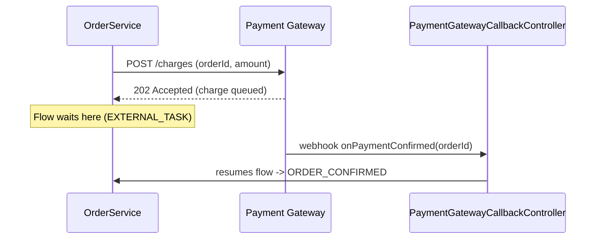

# Tutorial: example prompts and expected results

*[Leia isso em português](TUTORIAL.pt-br.md)*

This walks through one realistic prompt per skill (two for `model-kikwi-process`, one per mode), what the
skill actually does with it internally, and what comes back — including behaviors that are easy to miss
just from reading the `SKILL.md` files: a construction skill flagging a genuine gap in the input instead of
inventing an answer, `model-kikwi-process`'s draft mode leaving technical fields out entirely rather than
guessing at them, and the deliberate multi-pass handoffs from a construction skill into
`beautify-kikwi-diagram`/`implement-kikwi-components`. Full output files referenced below live under each
skill's `examples/` folder — this document only shows excerpts.

Prerequisite: copy `skills/` into `.claude/skills/` in your target project (see [`README.md`](README.md)
for the exact steps) so Claude Code can discover them.

---

## 1. `model-kikwi-process` — spec → deployable process

### Prompt

> "Model a Kikwiflow process for our expense approval flow: an employee submits an expense report, the
> system validates the data, then it's routed to the employee's manager for approval. If the manager
> doesn't respond within 48 hours, escalate to the finance team for review."

### What the skill does with it

1. **Step 1** walks the sentence and maps each business cue to a node type: "submits" → `DEFAULT_START_EVENT`,
   "system validates" → `EXECUTABLE_TASK`, "routed to the manager for approval" → `EXTERNAL_TASK`, "doesn't
   respond within 48 hours, escalate" → `BOUNDARY_INTERRUPTIVE_TIMER` attached to that `EXTERNAL_TASK`.
2. Before finalizing, it runs the **"handle gaps explicitly"** check from Step 1. This spec describes what
   happens on timeout, but never says what happens if the manager explicitly *rejects* the expense — only
   silence is handled. That's a load-bearing gap (it changes what the process actually does), so the skill
   either asks a clarifying question or — running autonomously — models only what the spec supports and
   flags the gap prominently in the delivery notes instead of inventing a rejection path.
3. **Step 2–4** produce the exact engine field names and try to resolve `executor: expenseValidationTaskHandler`
   against a real `TaskHandler` bean in the target project (or list it as a component to implement if none
   exists).
4. **Step 5** leaves every `layout` zeroed — that's `beautify-kikwi-diagram`'s job, not this skill's.

### Result (excerpt)

Full file: [`skills/model-kikwi-process/examples/expense-approval.kikwi.json`](skills/model-kikwi-process/examples/expense-approval.kikwi.json)

```json
"AWAIT_APPROVAL": {
  "id": "AWAIT_APPROVAL", "name": "Await Manager Approval", "type": "EXTERNAL_TASK",
  "commitBefore": true, "commitAfter": false,
  "outgoing": [{ "id": "flow-3", "targetNodeId": "APPROVED", "isDefault": false, "handlesNull": false, "name": "", "description": "" }],
  "boundaryEventIds": ["ESCALATE_TIMER"],
  "extensionProperties": {}, "layout": { "x": 0, "y": 0 }
},
"ESCALATE_TIMER": {
  "id": "ESCALATE_TIMER", "name": "48h No Response", "type": "BOUNDARY_INTERRUPTIVE_TIMER",
  "attachedToRef": "AWAIT_APPROVAL", "providerType": "STATIC", "staticValue": "PT48H",
  "outgoing": [{ "id": "flow-4", "targetNodeId": "AWAIT_FINANCE_REVIEW", "isDefault": false, "handlesNull": false, "name": "", "description": "" }],
  "commitBefore": false, "commitAfter": false, "extensionProperties": {}, "layout": { "x": 0, "y": 0 }
}
```

### What ships alongside the file

Per Step 7, the delivery isn't just the JSON — it's the file plus:

- **Components to implement**: `expenseValidationTaskHandler` (needs a `TaskHandler` bean), if no matching
  bean was found in the target project.
- **Assumptions and open questions**: *"the spec never states what happens if the manager explicitly rejects
  the expense — only the no-response timeout is modeled; confirm whether a rejection path is needed."*
- Confirmation that `beautify-kikwi-diagram` still needs to run — see §4 below.

This is the point of the skill flagging gaps instead of guessing: a rejection path silently invented here
would look complete and deploy fine, then be *wrong* the first time a manager actually clicks reject.

---

## 2. `model-kikwi-process` in draft mode — sketching without technical detail

### Prompt

> "Let's sketch a credit approval process: customer requests a loan, we analyze credit, then route to
> contract signature if approved or notify the customer if rejected. I don't know the technical details
> yet — just want to see the shape first."

No target project is referenced, and the prompt says outright the technical details aren't known yet —
exactly the signal Step 0 looks for.

### What the skill does with it

1. **Step 0** reads those signals — no codebase in context, "I don't know the technical details yet" —
   and picks **draft mode** instead of deploy mode. It says so up front, rather than silently proceeding
   as if this were a normal deploy-grade request.
2. **Step 1** maps business language to node types exactly like §1 — draft mode doesn't change *what* the
   graph looks like, only how much technical detail gets attached to it.
3. Where deploy mode would need `providerType`/`providerBean` on the `EXCLUSIVE_GATEWAY`, or `executor` on
   each `EXECUTABLE_TASK`, draft mode **leaves those fields out** rather than inventing a plausible-looking
   `providerType: VARIABLE` or a fake bean name — and puts the open decision directly into that node's
   `description` instead, so a developer picking this up later knows exactly what's still unresolved.
4. **Step 6** validates against [`schemas/kikwi-draft.schema.json`](schemas/kikwi-draft.schema.json) — it
   only checks that node types are real and edges point somewhere, not that any technical field is present.
5. **Step 7**'s delivery is reframed: stated plainly as a **draft, not deployable**, with an "open technical
   decisions" list pulled from the node descriptions — not a "components to implement" TODO, since there's
   no bean name yet for `implement-kikwi-components` to act on.

### Result (excerpt)

Full file: [`skills/model-kikwi-process/examples/credit-approval.draft.kikwi.json`](skills/model-kikwi-process/examples/credit-approval.draft.kikwi.json)

```json
"CREDIT_DECISION": {
  "id": "CREDIT_DECISION", "name": "Credit Approved?", "type": "EXCLUSIVE_GATEWAY",
  "description": "Routes on the outcome of the credit analysis. Open technical decision: is the
    approve/reject call made by a rule engine bean (providerType: BEAN) or is it just reading a
    variable ANALYZE_CREDIT already set (providerType: VARIABLE)? Not decided yet.",
  "outgoing": [
    { "id": "flow-3", "targetNodeId": "SEND_TO_SIGNATURE", "name": "Approved", "expectedAnswer": "APPROVED" },
    { "id": "flow-4", "targetNodeId": "NOTIFY_REJECTION", "name": "Rejected", "isDefault": true }
  ]
}
```

Note what's *not* there: no `providerType`, no `providerBean`/`providerVariable`. Validating this file
against `schemas/kikwi-deploy.schema.json` instead of the draft schema fails with exactly those three
fields reported missing — which is the point, not a bug. This file was never meant to pass that schema yet.

### Hardening it later

Once the technical decisions are actually made (say, engineering confirms the decision is a rule-engine
bean), handing the same file back to `model-kikwi-process` with that answer runs the skill again in
**deploy mode** over the same graph — Steps 1–3 don't need redoing, only Step 4 (fill in what draft mode
left out) and Steps 6–7 as normal. It's the same skill, same node-type mapping, just the mode flag flipped
once there's something real to resolve.

---

## 3. `document-java-as-kikwi` — existing code → documentation diagram

### Prompt

> "Document this order processing service as a `.kikwi` so a new hire can see the flow without reading
> `OrderService` line by line. Focus on `OrderController` and `OrderService`."

Imagine `OrderService.validateOrder(Order order)` checks stock and shipping region, `OrderController`
handles payment method branching, and `PaymentGatewayCallbackController` receives an async webhook from an
external payment gateway (with a separate decline webhook that cancels the wait).

### What the skill does with it

1. **Step 1** reads the code and maps it at business-process level, not code level — the entry point becomes
   `DEFAULT_START_EVENT`, the validation method becomes one `EXECUTABLE_TASK` (not two nodes for its two
   internal `if` checks — see the granularity note in Step 4), the payment-method branch becomes an
   `EXCLUSIVE_GATEWAY`, and the async gateway call becomes an `EXTERNAL_TASK` with a
   `BOUNDARY_INTERRUPTIVE_CATCH_EVENT` for the decline webhook (**not** `BOUNDARY_ERROR_HANDLER` — that type
   is only valid on `EXECUTABLE_TASK`, per the boundary-attachment table).
2. **Step 4** is where this skill earns its keep over a flat property dump: every node gets a real code
   excerpt or a Mermaid diagram in `kikwi:documentation`, not just a name pointing at a class.
3. `executor: orderServiceValidateOrder` is a **descriptive label only** — this skill never claims it
   resolves to a real Spring bean, unlike `model-kikwi-process`.

### Result (excerpt)

Full file: [`skills/document-java-as-kikwi/examples/process-order.kikwi.json`](skills/document-java-as-kikwi/examples/process-order.kikwi.json)

A real code excerpt attached to the validation step:

```json
"kikwi:documentation": "Checks item availability against `InventoryService` and rejects orders whose shipping address falls outside a supported region.\n\n```java\npublic void validateOrder(Order order) {\n    if (!inventoryService.hasStock(order.getItems())) {\n        throw new OrderValidationException(\"OUT_OF_STOCK\");\n    }\n    ...\n}\n```"
```

A Mermaid sequence diagram attached to the async payment step, because more than one system is involved in
the round trip:



Both render inside the Kikwiflow visual editor's fullscreen documentation preview for that node — a reader
never has to leave the diagram to see the real logic.

---

## 4. Chaining into `beautify-kikwi-diagram`

Take the expense-approval file from §1 — every `layout` is still `{ "x": 0, "y": 0 }`. Handing that file to
`beautify-kikwi-diagram` with a prompt like:

> "Lay out this expense-approval.kikwi file so it's readable."

runs Steps 1–4 of that skill: it identifies `START → VALIDATE → AWAIT_APPROVAL → APPROVED` as the main path,
recognizes `ESCALATE_TIMER → AWAIT_FINANCE_REVIEW` as a branch that reconverges on `APPROVED`, sizes each
node by family (`AWAIT_APPROVAL` is an `EXTERNAL_TASK` — 300px wide, +35px taller for the boundary timer
badge it now carries), and places the branch on its own row below the main line so it doesn't collide with
it. It changes **only** `layout` — every `executor`, `providerType`, `attachedToRef`, and `errorCode` from §1
is byte-for-byte unchanged.

| Node | Before (§1) | After |
|---|---|---|
| `START` | `{x:0, y:0}` | `{x:0, y:300}` |
| `VALIDATE` | `{x:0, y:0}` | `{x:350, y:300}` |
| `AWAIT_APPROVAL` | `{x:0, y:0}` | `{x:850, y:300}` |
| `AWAIT_FINANCE_REVIEW` | `{x:0, y:0}` | `{x:850, y:600}` — its own row, reconverging at `APPROVED` |
| `APPROVED` | `{x:0, y:0}` | `{x:1350, y:300}` — back on the main line |

Full result: [`skills/beautify-kikwi-diagram/examples/expense-approval.beautified.kikwi.json`](skills/beautify-kikwi-diagram/examples/expense-approval.beautified.kikwi.json).
This is also the answer to "why not just ask one skill to do both at once": getting node types/attachments
right and getting pixel placement right are different kinds of reasoning, and the split keeps the coordinates
above from being derived by guesswork mixed into the same pass as the graph logic.

---

## 5. Closing the loop: `implement-kikwi-components`

Back in §1, the expense-approval delivery listed one open item: `expenseValidationTaskHandler` needs a
real `TaskHandler` bean. Handing that same `.kikwi` (or just that one line from the delivery) to
`implement-kikwi-components` with a prompt like:

> "Implement the components this expense-approval process still needs."

produces a real, compiling Java class — but not a guessed-at validation rule. The `VALIDATE` node's
`description` was empty; the original spec only ever said "the system validates the data," never *how*.
Per the skill's "wire correctly, guess nothing" rule, the generated handler is fully wired (the exact
bean name, the right interface, the right package/testing conventions) but fails loudly instead of
silently no-op'ing or inventing a plausible-looking rule:

```java
@Component("expenseValidationTaskHandler")
public class ExpenseValidationTaskHandler implements TaskHandler {
    @Override
    public void handle(ExecutionContext execution) {
        // TODO(kikwiflow): the source spec only said "the system validates the data" — no concrete
        // rule was ever stated. Wire the real rule here before this handler is production-ready.
        throw new UnsupportedOperationException(
            "expenseValidationTaskHandler: validation rule not yet specified — see TODO above");
    }
}
```

Full example (class + matching unit test):
[`skills/implement-kikwi-components/examples/`](skills/implement-kikwi-components/examples/). The
delivery alongside it calls this out as an **open TODO**, the same way `model-kikwi-process` flagged the
missing rejection path in §1 — the discipline is the same one level down the stack: don't let a generated
artifact *look* finished when a real decision is still missing.

This skill and `beautify-kikwi-diagram` are both independent follow-ups to `model-kikwi-process` — order
between them doesn't matter, since one only ever writes Java source and the other only ever touches
`layout` in the `.kikwi`; neither reads what the other produced.

---

## 6. Optional: sanity-checking a result

`model-kikwi-process` (deploy mode) and `document-java-as-kikwi` outputs each have a structural JSON
Schema under [`schemas/`](schemas/) — [`kikwi-deploy.schema.json`](schemas/kikwi-deploy.schema.json) and
[`kikwi-docs.schema.json`](schemas/kikwi-docs.schema.json) respectively.
[`kikwi-draft.schema.json`](schemas/kikwi-draft.schema.json) is the third, deliberately light one for §2's
draft mode — see there for why validating a draft against the deploy schema is *expected* to fail. The two
strict schemas catch shape mistakes (a missing `executor` on an `EXECUTABLE_TASK`, an unknown field, a bad
`providerType` enum value) but — deliberately — not the full semantic rule set (unreachable nodes,
`kikwi:documentation`/`kikwi:documentationLink` both set). That deeper pass is what each skill's
`reference/validation-checklist.md` is for; the schema is a fast first filter, not a replacement for it.

```bash
pip install jsonschema
python3 -c "
import json, jsonschema
schema = json.load(open('schemas/kikwi-deploy.schema.json'))
doc = json.load(open('skills/model-kikwi-process/examples/expense-approval.kikwi.json'))
jsonschema.validate(doc, schema)
print('valid')
"
```
