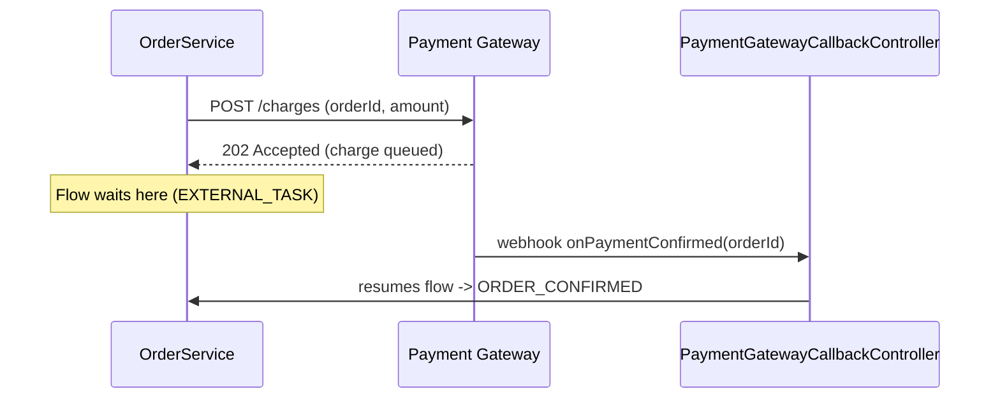

# Tutorial: exemplos de prompts e resultados esperados

*[Read this in English](TUTORIAL.md)*

Este tutorial percorre um prompt realista por skill, o que a skill realmente faz com ele internamente, e o
que volta como resultado — incluindo os dois comportamentos mais fáceis de passar batido só lendo os
`SKILL.md`: uma skill de construção sinalizando uma lacuna genuína do input em vez de inventar uma resposta,
e a passagem deliberada em duas etapas de uma skill de construção para a `beautify-kikwi-diagram`. Os
arquivos completos referenciados abaixo vivem na pasta `examples/` de cada skill — este documento só mostra
trechos.

Pré-requisito: copie `skills/` para `.claude/skills/` no projeto alvo (veja [`README.md`](README.md) para os
passos exatos) para que o Claude Code descubra as skills.

---

## 1. `model-kikwi-process` — spec → processo implantável

### Prompt

> "Modele um processo Kikwiflow para o nosso fluxo de aprovação de despesas: um funcionário envia um
> relatório de despesas, o sistema valida os dados, e então é encaminhado para o gestor do funcionário
> aprovar. Se o gestor não responder em 48 horas, escale para o time financeiro revisar."

### O que a skill faz com isso

1. O **Step 1** percorre a frase e mapeia cada indício de linguagem de negócio para um tipo de nó: "envia" →
   `DEFAULT_START_EVENT`, "o sistema valida" → `EXECUTABLE_TASK`, "encaminhado para o gestor aprovar" →
   `EXTERNAL_TASK`, "não responder em 48 horas, escale" → `BOUNDARY_INTERRUPTIVE_TIMER` anexado a esse
   `EXTERNAL_TASK`.
2. Antes de finalizar, ela roda a checagem **"lidar com lacunas explicitamente"** do Step 1. Essa spec
   descreve o que acontece no timeout, mas nunca diz o que acontece se o gestor explicitamente *rejeitar* a
   despesa — só o silêncio é tratado. Essa é uma lacuna estrutural (muda o que o processo de fato faz),
   então a skill ou faz uma pergunta de esclarecimento, ou — rodando de forma autônoma — modela só o que a
   spec sustenta e sinaliza a lacuna com destaque nas notas de entrega, em vez de inventar um caminho de
   rejeição.
3. Os **Steps 2–4** produzem os nomes exatos de campo do engine e tentam resolver
   `executor: expenseValidationTaskHandler` contra um bean `TaskHandler` real no projeto alvo (ou listá-lo
   como componente a implementar, se nenhum existir).
4. O **Step 5** deixa todo `layout` zerado — isso é trabalho da `beautify-kikwi-diagram`, não desta skill.

### Resultado (trecho)

Arquivo completo: [`skills/model-kikwi-process/examples/expense-approval.kikwi.json`](skills/model-kikwi-process/examples/expense-approval.kikwi.json)

```json
"AWAIT_APPROVAL": {
  "id": "AWAIT_APPROVAL", "name": "Await Manager Approval", "type": "EXTERNAL_TASK",
  "commitBefore": true, "commitAfter": false,
  "outgoing": [{ "id": "flow-3", "targetNodeId": "APPROVED", "isDefault": false, "handlesNull": false, "name": "", "description": "" }],
  "boundaryEventIds": ["ESCALATE_TIMER"],
  "extensionProperties": {}, "layout": { "x": 0, "y": 0 }
},
"ESCALATE_TIMER": {
  "id": "ESCALATE_TIMER", "name": "48h No Response", "type": "BOUNDARY_INTERRUPTIVE_TIMER",
  "attachedToRef": "AWAIT_APPROVAL", "providerType": "STATIC", "staticValue": "PT48H",
  "outgoing": [{ "id": "flow-4", "targetNodeId": "AWAIT_FINANCE_REVIEW", "isDefault": false, "handlesNull": false, "name": "", "description": "" }],
  "commitBefore": false, "commitAfter": false, "extensionProperties": {}, "layout": { "x": 0, "y": 0 }
}
```

### O que acompanha o arquivo

Segundo o Step 7, a entrega não é só o JSON — é o arquivo mais:

- **Componentes a implementar**: `expenseValidationTaskHandler` (precisa de um bean `TaskHandler`), caso
  nenhum bean correspondente tenha sido encontrado no projeto alvo.
- **Premissas e questões em aberto**: *"a spec nunca declara o que acontece se o gestor explicitamente
  rejeitar a despesa — só o timeout de não-resposta está modelado; confirmar se um caminho de rejeição é
  necessário."*
- Confirmação de que a `beautify-kikwi-diagram` ainda precisa rodar — veja a §3 abaixo.

Esse é o ponto de a skill sinalizar lacunas em vez de adivinhar: um caminho de rejeição inventado
silenciosamente aqui pareceria completo e passaria no deploy tranquilamente, e só estaria *errado* na
primeira vez que um gestor de fato clicasse em rejeitar.

---

## 2. `document-java-as-kikwi` — código existente → diagrama de documentação

### Prompt

> "Documente esse serviço de processamento de pedidos como um `.kikwi` para que um novo integrante da equipe
> consiga ver o fluxo sem ler `OrderService` linha por linha. Foca no `OrderController` e no `OrderService`."

Imagine que `OrderService.validateOrder(Order order)` checa estoque e região de entrega, `OrderController`
trata a ramificação por método de pagamento, e `PaymentGatewayCallbackController` recebe um webhook
assíncrono de um gateway de pagamento externo (com um webhook de recusa separado que cancela a espera).

### O que a skill faz com isso

1. O **Step 1** lê o código e mapeia no nível de processo de negócio, não no nível de código — o ponto de
   entrada vira `DEFAULT_START_EVENT`, o método de validação vira um único `EXECUTABLE_TASK` (não dois nós
   para seus dois `if`s internos — veja a nota de granularidade no Step 4), a ramificação por método de
   pagamento vira um `EXCLUSIVE_GATEWAY`, e a chamada assíncrona ao gateway vira um `EXTERNAL_TASK` com um
   `BOUNDARY_INTERRUPTIVE_CATCH_EVENT` para o webhook de recusa (**não** `BOUNDARY_ERROR_HANDLER` — esse tipo
   só é válido em `EXECUTABLE_TASK`, conforme a tabela de anexação de boundary events).
2. O **Step 4** é onde essa skill se justifica frente a um simples dump de propriedades: todo nó recebe um
   trecho de código real ou um diagrama Mermaid em `kikwi:documentation`, não só um nome apontando para uma
   classe.
3. `executor: orderServiceValidateOrder` é **apenas um rótulo descritivo** — essa skill nunca afirma que ele
   resolve para um bean Spring real, ao contrário da `model-kikwi-process`.

### Resultado (trecho)

Arquivo completo: [`skills/document-java-as-kikwi/examples/process-order.kikwi.json`](skills/document-java-as-kikwi/examples/process-order.kikwi.json)

Um trecho de código real anexado ao passo de validação:

```json
"kikwi:documentation": "Checks item availability against `InventoryService` and rejects orders whose shipping address falls outside a supported region.\n\n```java\npublic void validateOrder(Order order) {\n    if (!inventoryService.hasStock(order.getItems())) {\n        throw new OrderValidationException(\"OUT_OF_STOCK\");\n    }\n    ...\n}\n```"
```

Um diagrama de sequência Mermaid anexado ao passo assíncrono de pagamento, porque mais de um sistema está
envolvido na ida e volta:



Ambos renderizam dentro do preview de documentação em tela cheia do editor visual Kikwiflow para aquele nó —
o leitor nunca precisa sair do diagrama para ver a lógica real.

---

## 3. Encadeando com a `beautify-kikwi-diagram`

Pegue o arquivo de aprovação de despesas da §1 — todo `layout` ainda está `{ "x": 0, "y": 0 }`. Entregar esse
arquivo para a `beautify-kikwi-diagram` com um prompt como:

> "Organize o layout desse expense-approval.kikwi para que fique legível."

roda os Steps 1–4 dessa skill: ela identifica `START → VALIDATE → AWAIT_APPROVAL → APPROVED` como o caminho
principal, reconhece `ESCALATE_TIMER → AWAIT_FINANCE_REVIEW` como um ramo que reconverge em `APPROVED`,
dimensiona cada nó por família (`AWAIT_APPROVAL` é um `EXTERNAL_TASK` — 300px de largura, +35px mais alto
pelo badge do timer de boundary que agora carrega), e posiciona o ramo em sua própria linha abaixo da linha
principal para não colidir com ela. Ela muda **apenas** o `layout` — todo `executor`, `providerType`,
`attachedToRef` e `errorCode` da §1 permanece idêntico, byte a byte.

| Nó | Antes (§1) | Depois |
|---|---|---|
| `START` | `{x:0, y:0}` | `{x:0, y:300}` |
| `VALIDATE` | `{x:0, y:0}` | `{x:350, y:300}` |
| `AWAIT_APPROVAL` | `{x:0, y:0}` | `{x:850, y:300}` |
| `AWAIT_FINANCE_REVIEW` | `{x:0, y:0}` | `{x:850, y:600}` — linha própria, reconvergindo em `APPROVED` |
| `APPROVED` | `{x:0, y:0}` | `{x:1350, y:300}` — de volta à linha principal |

Resultado completo: [`skills/beautify-kikwi-diagram/examples/expense-approval.beautified.kikwi.json`](skills/beautify-kikwi-diagram/examples/expense-approval.beautified.kikwi.json).
Essa é também a resposta para "por que não pedir para uma única skill fazer as duas coisas de uma vez":
acertar os tipos de nó/anexações e acertar o posicionamento em pixels são tipos diferentes de raciocínio, e a
separação evita que as coordenadas acima sejam derivadas por tentativa e erro misturado com a mesma passada
da lógica do grafo.

---

## 4. Opcional: checagem de sanidade de um resultado

As saídas das duas skills de construção têm um JSON Schema estrutural em [`schemas/`](schemas/) —
[`kikwi-deploy.schema.json`](schemas/kikwi-deploy.schema.json) para a saída da `model-kikwi-process`,
[`kikwi-docs.schema.json`](schemas/kikwi-docs.schema.json) para a saída da `document-java-as-kikwi`. Eles
pegam erros de formato (um `executor` faltando em um `EXECUTABLE_TASK`, um campo desconhecido, um valor de
enum inválido para `providerType`) mas — deliberadamente — não o conjunto completo de regras semânticas
(edges `isDefault` duplicados, nós inalcançáveis, `kikwi:documentation`/`kikwi:documentationLink` ambos
definidos ao mesmo tempo). Essa checagem mais profunda é para o que serve o `reference/validation-checklist.md`
de cada skill; o schema é um primeiro filtro rápido, não um substituto para ele.

```bash
pip install jsonschema
python3 -c "
import json, jsonschema
schema = json.load(open('schemas/kikwi-deploy.schema.json'))
doc = json.load(open('skills/model-kikwi-process/examples/expense-approval.kikwi.json'))
jsonschema.validate(doc, schema)
print('valid')
"
```
